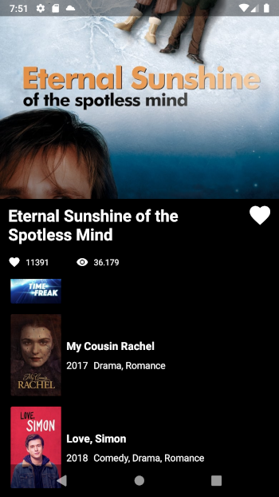

<div align="center">

[English](../README.md) | Portuguese

</div>

# O aplicativo

É um aplicativo desenvolvido em Kotlin. Ele acessa a API
do [The Movie DB API](https://developers.themoviedb.org/3/getting-started/introduction) e exibe
informações sobre um filme, assim como uma lista de filmes similares.

## Stack

- **Koin** para injeção de dependência
- **Retrofit2** para acesso à API
- **Glide** para gerenciamento de imagens
- **Coroutines** para gerenciamento de *multithreading*
- **Lifecycle** para lidar com LiveData e ViewModel
- **Gson** para manipulação de JSON
- **JUnit4** para testes
- **MockK** e **MockWebServer** para criação mocks de dependências
- **Espresso** para testes de UI

## Mais sobre o código e as funcionalidades

<br />

<div align="center">



<br />

https://user-images.githubusercontent.com/62512714/133094694-1b0ed908-36d9-4774-a361-3b120a7ab813.mp4

</div>

<br />

Eu segui as especificações presentes no *briefing* e tentei usar todas elas como oportunidades de
aprendizagem. Dito isso, alguns elementos com os quais trabalhei e soluções encontradas que podem
despertar reflexões prévias são:

#### SharedPreferences:

Eu escolhi usá-las para adicionar persistência de dados ao botão de like, mas a simples demonstração
do comportamento de seleção, como solicitado, poderia ser alcançada por:

```kotlin
liked = !liked
binding.btLike.isSelected = liked
```

Esse trecho de código ficaria no evento de *click* do botão, tendo o "liked" como variável do tipo
Boolean.

#### Arquitetura Clean:

Uma vez que o *briefing* ofereceu ela como uma possibilidade, decidi praticar, porque algumas aulas
que tive chegaram a apresentar a *Clean Architecture*, mas sem se deter nos detalhes. Esse também é,
inclusive, o motivo pelo qual decidi trabalhar com Koin para injeção de dependência.

Como diz o ditado, "a prática leva à perfeição" e, mesmo não dominando completamente essas
tecnologias ainda, consigo entender um pouco melhor agora do que da primeira vez.

#### Protegendo dados sensíveis:

Procurando na internet por formas de proteger minha chave API (já que é necessária para o
funcionamento do aplicativo, mas continua sendo uma chave pessoal), acabei me deparando com esse
princípio.

Não é uma boa prática mandar dados sensíveis para repositórios públicos. Por isso, eu decidi
trabalhar com essa solução (armazená-la em um arquivo do sistema que não é mandado para o
repositório público.

Assim, a última versão do projeto provavelmente não funcionará para você. Para corrigir isso, você
precisa criar, no seu arquivo *local.properties*, a seguinte variável:

```properties
tmdb_api_key="<Your API Key>"
```

E colocar nela uma chave aceita pela API.

#### Testes:

Essa é uma área na qual tenho focado recentemente, porque é um aspecto fundamental no dia-a-dia de
um desenvolvedor, mas normalmente negligenciado em cursos e aulas.

Por esse motivo, pratiquei aqui com alguns testes de unidade, de instrumentação e de UI, mas não
apresento cobertura total do código. Esse é o mesmo motivo pelo qual, nos testes de UI, usei *Lock*
e *Thread.Sleep* como soluções para contornar o comportamento *multithread* do aplicativo, mesmo com
a documentação desencorajando essa atitude.

Em seu lugar, é sugerido usar *Idling Resources*, mas admito precisar de mais estudo e prática com
essa ferramenta.

#### Tratamento de erros:

No código, há espaço para tratamento de erros, como apliquei em outros projetos. Algumas
possibilidades são: Falha na conexão, API Key inválida, Ausência de API Key, alerta sobre mudanças
na resposta obtida dos endpoints, etc. Infelizmente, acabei investindo mais tempo nos testes, embora
pretenda implementá-lo no futuro (assim como outras ideias de melhoria que já tenho).

Acredito que esses são destaques suficientes sobre o código no momento, mas ficarei feliz em
responder perguntas sobre as soluções implementadas nesse projeto, falar sobre apectos em que
poderia melhorar ou discutir oportunidades para eu praticar e aprender ainda mais.

Foi uma ótima oportunidade poder praticar e me divertir com esse projeto. Por isso, agradeço à M2Y e
Bruna Valério.


<br />

<div align="center">


</div>
